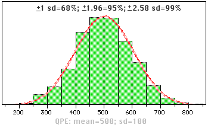

layout: true
  
<div class="my-footer"><span>

<a href="https://steven.metodosquantitativos.com/">Steven Ross</a> 

</span></div>

---

```{r setup, include=FALSE}
options(htmltools.dir.version = FALSE)
knitr::opts_chunk$set(echo = FALSE, fig.align = "center", out.width = "60%")
library(fontawesome)
```


```{css, echo=FALSE}
@import url('https://fonts.googleapis.com/css?family=Chilanka&display=swap');
@import url('https://fonts.googleapis.com/css2?family=Gloria+Hallelujah&display=swap');

.myfont {
  color: #fff;
  font-family: 'Gloria Hallelujah', cursive;
  font-size: 80px;
}

.preto {
  color: black;
  font-size: 30px;
}

```


```{r xaringan-themer, include=FALSE, warning=FALSE}
library(xaringanthemer)
style_duo_accent(
  primary_color = "#1381B0",
  secondary_color = "#FF961C",
  inverse_header_color = "#FFFFFF",
  title_slide_background_color ="#fff")
```

```{r xaringan-panelset, echo=FALSE}
xaringanExtra::use_panelset()
```

```{r meta, eval=FALSE, echo=FALSE,message=FALSE,warning=FALSE}
library(metathis)
meta() %>%
  meta_general(
  description = "Modelos lineares") %>%
  meta_description("Modelos lineares")
# class: center, middle
 
```

# Modelo linear 

### Vamos ajustar um modelo linear.

```{r, fig.cap="<center><b>Normal</b></center>"}
# 
```

---


```{r, echo=FALSE,warning=FALSE,message=FALSE,comment=NA, out.width = "62%"}

```


---

.panelset[
.panel[.panel-name[Código]

## Como calcular probabilidades utilizando a tabela da normal?

```{r, echo=TRUE,eval=FALSE, warning=FALSE,comment=NA,message=FALSE}

library(RcmdrMisc)  
.x <- seq(-3.291, 3.291, length.out=1000)    
plotDistr(.x, dnorm(.x, mean=0, sd=1), cdf=FALSE, xlab="x", ylab="Densidade",regions=list(c(0, 4)), col=c('#0080C0', '#BEBEBE'), legend=FALSE)  
```

]

.panel[.panel-name[Gráfico]

```{r, echo=FALSE, message=FALSE, warning=FALSE,, out.width = "55%"}
library(RcmdrMisc)
.x <- seq(-3.291, 3.291, length.out=1000)  
plotDistr(.x, dnorm(.x, mean=0, sd=1), cdf=FALSE, xlab="x", ylab="Densidade",regions=list(c(0, 4)), col=c('#0080C0', '#BEBEBE'), legend=FALSE)
```

]

.panel[.panel-name[Tabela]

```{r, echo=TRUE,eval=FALSE, warning=FALSE,comment=NA,message=FALSE}
u=seq(0,3.09,by=0.01)  
p=pnorm(u)  
p=p-0.5  
m=matrix(p,ncol=10,byrow=TRUE)  
m=round(m,4)  
DT::datatable(m)  
```

]

]


## Qualquer distribuição normal pode ser padronizada. Essa abordagem é dada pela definição de uma nova variável *Z*, chamada de variável aleatória normal padronizada, dada pela função:

$$ z = \frac{x - \mu}{\sigma}$$

onde X é uma variável aleatória com distribuição normal com média μ e variância σ2.

## Definição: 

$$ z \sim N(0,1) $$

---


## Gráfico QQ

#### Como descobrir se a sua variável tem uma distribuição Normal?

#### Um gráfico QQ é usado para avaliar visualmente quão próxima uma variável está da distribuição normal. Se os pontos caem  na linha diagonal, então a distribuição dos dados podem ser consideradas perto de uma normal. Para fazer o gráfico QQ no R, podemos utilizar a função *qqnorm()*.

```{r, echo=TRUE,eval=FALSE, warning=FALSE,comment=NA,message=FALSE}
amostra_normal<-rnorm(100)
qqnorm(amostra_normal,col="red")
abline(a=0,b=1)
```

---

```{r, warning=FALSE,comment=NA,message=FALSE}
amostra_normal<-rnorm(100)
qqnorm(amostra_normal,col="blue", main = "QQ-Plot de uma normal")
abline(a=0,b=1)

```


---

```{r, warning=FALSE,comment=NA,message=FALSE}
amostra_exponencial<- rexp(100,3)
qqnorm(amostra_exponencial,col="red", main = "QQ-Plot de uma gamma")
abline(a=0,b=1)

```


---

# Atividade: avalie quais as variáveis quantitativas das bases de dados *CARROS* e *Questionario Estresse* seguem uma distribuição Normal usando o gráfico QQ-plot.

---


Referências    
1. BRUCE, Peter & BRUCE, Andrew **Estatística Prática Para Cientistas De Dados – 50 conceitos essenciais** Alta books, 320 p, 2019.   
2. STEVENSON, Wiliam J. **Estatística aplicada à administração**. 1986.   
<!--MILZ,Beatriz **Introdução ao pacote xaringan Criando apresentações com R**, 2019. Disponível em: https://beatrizmilz.github.io/IME-27-08-2019/-->